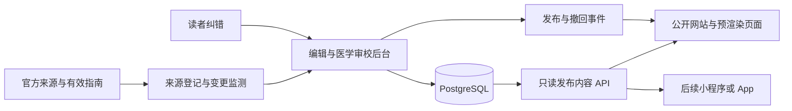

# 知识来源、医学质量与内容平台方案

> 定位调整（2026-09-19）：本文保留早期内容治理方案及来源调研记录，不再是当前执行路线。基础知识不再一律要求独立专业审校；最新来源核对、风险分级及可选审校政策以 [产品规划](product-plan.md) 第 5 节为准，实施顺序见 [路线图](roadmap.md)。下文的强制审校、内容规模与平台扩建建议视为历史方案，来源/接口事实也需在实际使用时重新核对。`0.0.1-beta.13` 已实现轻量来源整理发布路径，但不能据此绕过风险范围、来源定位、权限或版本绑定检查。

日期：2026-09-19。本文保留完整目标架构。`0.0.1-beta.2` 已实现 PostgreSQL、Payload CMS、版本绑定审校、正式/演示发布集合与回滚撤回，具体落地采用 Payload 原生版本加不可变修订，见 [当前平台说明](content-platform.md)。到期复核、自动来源监测等仍为后续计划。来源网站的在线检查不等同于对全部医学内容完成审校。

## 1. 先区分存储问题与可信度问题

JSON 可以保存可靠知识，数据库也可以保存错误知识。当前真正的缺口是：缺少统一来源库、逐条主张的依据、适用范围、审校身份与版本绑定、发布权限、纠错与到期复核。数据库和后台用于让这些机制可执行、可追溯。

现有内容已引用 WHO、NIDDK、NHLBI、MedlinePlus 等机构，不能简单称为“没有靠谱来源”。但 8 篇内容全部标记为待审校，来源分散在文件内，同一来源重复保存；页面还包含写在 JSX 中的科普文字。这些都需要进入同一内容治理范围。

面向大众公开运营后，即使只有几十篇内容，也建议引入内容后台。引入理由是审校、更新和发布治理，而不只是搜索性能或数据量。

## 2. 来源采用多层组合，不能只接一个接口

| 来源层级 / 候选 | 主要用途 | 接入方式 | 重要边界 |
| --- | --- | --- | --- |
| 国家卫生健康委、中国疾控中心等国内公共机构 | 中国语境的公共卫生、健康素养、预防与人群建议 | 建来源目录，人工选择具体文件/科普条目并追踪版本 | 机构首页不是具体论断的引用；不假设有稳定开放 API，也不因公开可见就默认可批量转载 |
| 国内专业学会及正规出版渠道的指南/共识 | 指标解释、诊断标准语境、适用人群与本土更新 | 审校人选择有效版本，登记具体指南及定位 | 是专业证据材料，不适合直接当大众正文；指南也有适用范围、证据局限和版权 |
| MedlinePlus / NLM | 主题目录、英文基础科普、来源导航 | 使用官方主题 XML / Web Service 获取目录和允许使用的数据；中文由编辑整理并审校 | 官方服务主要为英文、西班牙文，不能直接当中文知识库；医学百科、药品资料等可能有第三方版权 |
| NIDDK、NHLBI | 代谢、肾脏、心肺等基础解释 | 按专题人工选文，登记正文位置、更新时间和授权说明 | 不将美国页面中的阈值直接推广为中国所有用户通用结论 |
| WHO | 全球公共卫生、疾病事实、预防原则 | 按具体出版物或事实清单引用，逐项确认许可 | 部分许可限定非商业使用；不同内容许可不一，机构标识不等于产品背书 |
| NHS 等国家健康服务科普 | 通俗表达、检查和就医流程写作参考 | 核对许可后整理，做地域适用性审查 | 英国就医流程和建议不直接适用于中国；OGL 也有例外范围 |
| 系统综述与研究论文 | 为特定问题补充证据与解释争议 | 专业审校人检索、评估和关联 | PubMed 等是检索入口，不是质量认证；单篇研究不自动成为大众建议 |

建议启动组合：国内公共机构与有效指南提供本土适用性，MedlinePlus 提供主题索引，NIDDK / NHLBI / WHO 等补充基础解释，由编辑和审校人形成知愈自己的中文知识页。先聚焦体检与代谢健康，不导入整站内容充数。

来源冲突不能简单按“国内优先”或“更新日期更新就正确”自动解决。审校人需要比较人群、地域、研究设计、指南有效性、论断类型与证据强度，记录采用依据和保留意见。

## 3. 截至本次检查可以确认的接口与授权事实

2026-09-19 在线检查结果：

- [MedlinePlus 使用说明](https://medlineplus.gov/about/using/usingcontent/)明确区分公共领域内容与第三方受版权保护内容；不能把 A.D.A.M. 医学百科、药品专论等随主题数据一起复制。具体字段和正文以对应页面声明为准。
- [MedlinePlus Web Service](https://medlineplus.gov/about/developers/webservices/)提供按关键词查询的主题 XML，支持英文和西班牙文；页面说明无需注册或许可密钥，并列出每个 IP 每分钟 85 次请求的限制。实现前仍须复核当时规则，服务端缓存、限流，不让每位读者直接请求上游。
- 该服务文档指向 [完整主题 XML](https://medlineplus.gov/xml.html)。本次独立抓取该 XML 说明页出现网络失败，因此仅确认官方服务页提供此入口，尚未验证具体下载结构与更新频率。
- [WHO 版权说明](https://www.who.int/about/policies/publishing/copyright)说明部分材料采用 CC BY-NC-SA 3.0 IGO，其他材料需按具体许可处理。引用、翻译、全文复制、商业使用和使用 Logo 是不同事项。
- [NHS 使用条款](https://www.nhs.uk/our-policies/terms-and-conditions/)说明内容的 OGL 使用范围及例外。不能据此推断所有页面、图片或第三方素材都可无条件复用。
- [中国疾控中心](https://www.chinacdc.cn/)首页可访问；[国家卫生健康委](https://www.nhc.gov.cn/)本次自动访问返回 412。两者作为来源候选，尚未对具体栏目、接口或转载授权做完整核验。

上线前应保存每个来源的许可记录与核验日期；接口可访问不等于全文可再发布。项目源码的开源许可证不覆盖引用文章、图片或译文，代码授权与内容授权应分别说明。

## 4. 编辑流程：从证据到可公开的文章

建议工作流：

```text
选题与用户问题
  → 来源登记与授权检查
  → 提取关键论断及适用范围
  → 通俗中文草稿
  → 编辑核对表达、引用和完整性
  → 医学审校具体版本
  → 发布该版本
  → 反馈、来源监测与定期复核
  → 修订 / 更正 / 撤回
```

每个关键医学论断关联一个或多个具体依据，例如页码、段落标题、稳定锚点或允许保存的短摘录。不能仅在文章底部堆一组机构链接，再默认每句话都已得到支持。

适用范围至少包括国家/地区、年龄或人群、健康状态以及特殊条件。数值必须区分单位、参考区间、诊断阈值、治疗目标和测量方法；没有明确依据的内容不得补成看似完整的数值表。

审校记录绑定不可变的内容修订版本及其内容哈希，包括审校人身份、审核时间、结论和意见。任何正文、适用范围或关键依据变更，均应触发新的审核判定；不能把旧版审核结果自动继承为新版医学背书。

后台权限可分为编辑、医学审校、发布管理。初期人员可以兼任编辑和维护，但医学审校能力需真实可核验；默认作者不能自行批准自己的医学内容。紧急撤回权限独立记录审计日志。

来源失效只触发检查，不自动说明原结论错误；来源被撤回、重大指南变更或发现严重内容错误则进入优先复核。建议内部设置风险分级，重大问题优先隐藏相关内容并调查，一般文字问题进入正常编辑队列。

## 5. 技术方案：模块化单体优先

建议目标组合为 PostgreSQL + Payload CMS + React 内容网站。未来公开内容页迁移 Next.js 时，可评估与 Payload 共用工程或单独部署；对外保留明确的内容 API，避免小程序/App 直接依赖后台内部数据结构。

选择理由：现有团队技术栈为 React/JavaScript，Payload 可配置内容集合、版本与草稿；PostgreSQL 适合内容、来源、审校和关系查询。医学审核、版本绑定、发布检查与外部来源监测仍需自定义，安装 CMS 不会自动得到这些能力。

备选为 Directus / Strapi 或独立管理后台。先用“编辑一篇文章—审校—发布—修订—回滚”的真实任务做短期技术验证，再决定最终 CMS。选择前核对指定版本的许可证、角色权限、版本管理和部署成本；本文不默认各产品的所有功能都免费或都适合开源分发。



初期不要求微服务、向量数据库或复杂推荐系统。数据库任务表与事务性 outbox 可承接发布事件、来源检查和重试；确有负载需求后再引入独立队列或缓存服务。检索先做精确名称、别名、缩写及分类，中文分词与容错用实际查询集验证，不默认 PostgreSQL 英文全文检索配置即可处理中文。

## 6. 建议数据模型

以下是领域实体，具体表名与字段根据 CMS 落地，不要求每个概念都额外建一套重复存储。

| 实体 | 主要字段与约束 |
| --- | --- |
| `contents` | 稳定 ID、slug、类型、分类、当前发布修订 ID、撤回状态；slug 唯一，修订不改变内容身份 |
| `content_revisions` | 内容 ID、版本、标题、摘要、模块化正文、适用范围、作者、内容哈希、编辑状态、创建时间；已审校版本不可原位篡改 |
| `source_documents` | 发布机构、标题、原始 URL/DOI、文献类型、语言、地区、发布日期、许可类别与许可链接 |
| `source_versions` | 来源 ID、版本/更新日期、核验时间、内容指纹、撤回标记、允许保存的证据定位信息 |
| `claims` 与 `claim_sources` | 论断、所属内容修订、适用条件、对应来源版本、页码/段落、审校备注；引用不得指向不存在的版本 |
| `reviews` | 修订 ID、审核人、资格核验记录关联、结论、意见、时间；只接受授权角色写入 |
| `authors` / `reviewers` | 展示姓名、专业领域、简介与授权；资格凭证与公开资料分开访问 |
| `topics`、`aliases`、`content_relations` | 主题、中文/英文别名、指标与器官关系、推荐理由及顺序；防止重复关系和失效目标 |
| `publications` / `audit_events` | 发布、修订、撤回、回滚和操作者，关联具体版本与事件 ID |
| `feedback` | 内容及修订 ID、问题类型、描述、处理状态；联系方式可选，限制意外敏感信息传播 |
| `review_tasks` / `source_checks` | 复核截止时间、风险级别、来源检查结果、负责人、重试和处理状态 |

来源网页可能禁止全文存储，不把“自动抓取全文快照”作为默认字段。允许的证据摘录、内容指纹、链接和人工记录足以构建基础追踪；图片与获授权附件放对象存储，数据库保存授权和对象元信息。

## 7. 公开接口与权限边界

保留现有契约方向，公开接口可挂在 `/api/v1`，由 `VITE_CONTENT_API_BASE_URL` 指向该前缀：

- `GET /content`：查询、分类、游标分页，只返回公开摘要。
- `GET /content/:kind/:id`：只返回当前可公开的修订、适用范围及可展示的来源/审校信息。
- 后续扩展主题与别名检索、作者公开信息、内容更正记录；读者纠错使用独立受限的 `POST` 接口。

匿名客户端不得指定任意草稿修订 ID 绕过发布过滤。后台编辑与预览接口必须认证，预览链接限时、不可被 CDN 公共缓存。未知内容返回 404；永久撤回内容可返回 410 或不含原正文的更正页，按撤回原因决定。

不要让浏览器拿到后台写入凭证。CMS 本地 API、管理 API 和公开 API 均需要权限检查，不能只依赖前端隐藏按钮。审校状态、发布版本和操作者从受控流程产生，不接收匿名提交的 `reviewed=true`。

## 8. 缓存、更新与撤回

发布事务同时记录可重试事件，触发文章页、专题页、搜索索引及分享元信息更新。事件采用唯一 ID，重复处理应安全；失败可追踪，不能静默丢失。

一般内容采用按发布事件更新并辅以定期重验证。重大医学错误撤回不应等待普通缓存过期：需要页面/接口缓存清除，以及可立即生效的撤回状态检查。建议以“执行撤回后 5 分钟内所有受控公开入口不再展示旧正文”作为初始演练目标，部署后测量并记录实际时间。

旧链接应指向当前版本或明确的更正/撤回说明。已经被用户保存的图片与第三方缓存无法保证删除，因此分享卡片应带文章链接和版本日期，不把图中一句话当作永久有效的医学建议。

## 9. 现有 JSON 的迁移

1. 清点现有 8 篇正文、摘要索引、器官关系及写在组件里的科普内容，保存迁移前版本。
2. 用 URL 与文档身份去重来源，保留原核验日期，不擅自填写新的审校结论。
3. 导入为待审校草稿，保留稳定 ID 和 slug，检查所有引用与关系。
4. 补齐适用范围、编辑责任人与医学审核记录，逐篇决定是否正式发布。
5. 使用同一组契约测试对比本地适配器与 API，验证分页、空收藏、未知内容、重试、取消与权限。
6. 在预览环境完成验收后切换前端数据源。迁移期间演示站点与正式发布集合明确区分；不会因为导入成功就把 8 篇待审校内容自动标成已审核。
7. 确认迁移结果和回滚路径后，将静态 JSON 保留为演示数据或测试夹具，避免两套内容长期同时手工维护。

## 10. 上线验收

- 医学结论有具体依据与适用范围，正式发布版本有可核验的审校记录。
- 引用、关系、单位与字段结构校验通过；自动测试只能检查结构与规则，不能证明医学正确。
- 草稿不能被匿名 API、预览链接、页面缓存或搜索接口泄露。
- 非授权用户无法修改审校记录或发布；正文改动不会继承旧版医学批准。
- 已演练内容修订、回滚、紧急撤回、缓存清理与备份恢复。
- 来源授权与开源代码许可证分别记录；需许可的内容未获许可前不复制发布。
- 来源失效、到期复核和读者纠错都有可追踪的处理入口。

## 参考入口

- [MedlinePlus 内容使用](https://medlineplus.gov/about/using/usingcontent/)
- [MedlinePlus Web Service](https://medlineplus.gov/about/developers/webservices/)
- [WHO 版权与许可](https://www.who.int/about/policies/publishing/copyright)
- [NHS 条款](https://www.nhs.uk/our-policies/terms-and-conditions/)
- [NIDDK 健康信息](https://www.niddk.nih.gov/health-information)
- [NHLBI 健康主题](https://www.nhlbi.nih.gov/health)
- [Payload 版本与草稿能力](https://payloadcms.com/docs/versions/overview)

接口、产品能力与授权条款会变化，正式接入时再次核对具体版本。没有一项工具或来源可以替代专业人员对知愈实际发布内容的责任。
